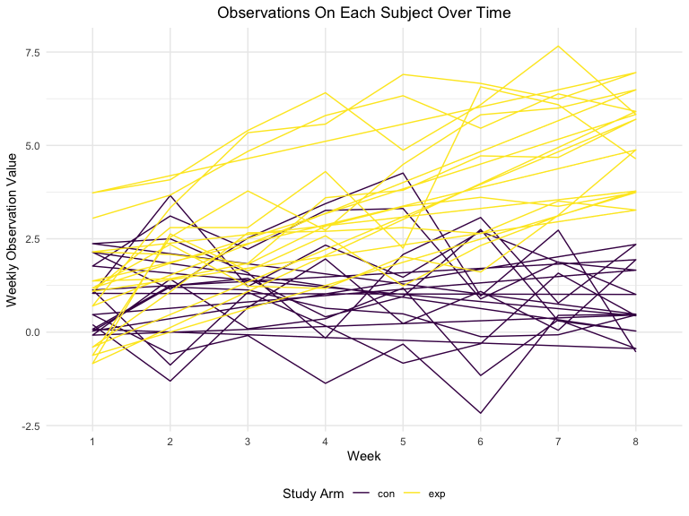
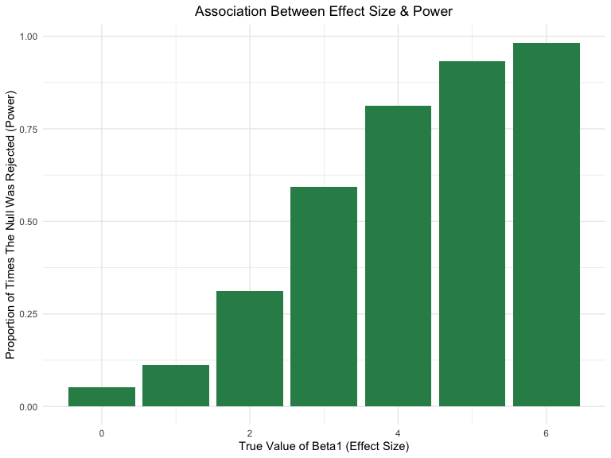

p8105\_hw5\_at3346
================
Ashley Tseng
11/3/2019

## Problem 1

``` r
iris_with_missing = iris %>% 
  janitor::clean_names() %>% 
  map_df(~replace(.x, sample(1:150, 20), NA)) %>%
  mutate(species = as.character(species))


iris_func = function(x) { 
  
  if (is.numeric(x)){
      replace(x, is.na(x), round(mean(x, na.rm = TRUE), digits = 1))
  }
  
  else {
    replace (x, is.na(x), "virginica")
  }
  
}
  
iris_no_missing = map_df(iris_with_missing, ~iris_func(.x))
```

## Problem 2

``` r
file_names = tibble(
  name = list.files(path = "./data/", all.files = TRUE, no.. = TRUE),
  file_path = str_c("./data/", name))

source_func = function(x){
  read_csv(x)
}

long_study = file_names %>% 
  mutate(source_name = map(file_names$file_path, source_func)) %>% 
  unnest() %>% 
  janitor::clean_names() %>% 
  select(-file_path) %>% 
  separate(name, into = c("study_arm","subject_id", "file_type")) %>%
  select(-file_type)
```

    ## Parsed with column specification:
    ## cols(
    ##   col_character()
    ## )

    ## Parsed with column specification:
    ## cols(
    ##   week_1 = col_double(),
    ##   week_2 = col_double(),
    ##   week_3 = col_double(),
    ##   week_4 = col_double(),
    ##   week_5 = col_double(),
    ##   week_6 = col_double(),
    ##   week_7 = col_double(),
    ##   week_8 = col_double()
    ## )
    ## Parsed with column specification:
    ## cols(
    ##   week_1 = col_double(),
    ##   week_2 = col_double(),
    ##   week_3 = col_double(),
    ##   week_4 = col_double(),
    ##   week_5 = col_double(),
    ##   week_6 = col_double(),
    ##   week_7 = col_double(),
    ##   week_8 = col_double()
    ## )
    ## Parsed with column specification:
    ## cols(
    ##   week_1 = col_double(),
    ##   week_2 = col_double(),
    ##   week_3 = col_double(),
    ##   week_4 = col_double(),
    ##   week_5 = col_double(),
    ##   week_6 = col_double(),
    ##   week_7 = col_double(),
    ##   week_8 = col_double()
    ## )
    ## Parsed with column specification:
    ## cols(
    ##   week_1 = col_double(),
    ##   week_2 = col_double(),
    ##   week_3 = col_double(),
    ##   week_4 = col_double(),
    ##   week_5 = col_double(),
    ##   week_6 = col_double(),
    ##   week_7 = col_double(),
    ##   week_8 = col_double()
    ## )
    ## Parsed with column specification:
    ## cols(
    ##   week_1 = col_double(),
    ##   week_2 = col_double(),
    ##   week_3 = col_double(),
    ##   week_4 = col_double(),
    ##   week_5 = col_double(),
    ##   week_6 = col_double(),
    ##   week_7 = col_double(),
    ##   week_8 = col_double()
    ## )
    ## Parsed with column specification:
    ## cols(
    ##   week_1 = col_double(),
    ##   week_2 = col_double(),
    ##   week_3 = col_double(),
    ##   week_4 = col_double(),
    ##   week_5 = col_double(),
    ##   week_6 = col_double(),
    ##   week_7 = col_double(),
    ##   week_8 = col_double()
    ## )
    ## Parsed with column specification:
    ## cols(
    ##   week_1 = col_double(),
    ##   week_2 = col_double(),
    ##   week_3 = col_double(),
    ##   week_4 = col_double(),
    ##   week_5 = col_double(),
    ##   week_6 = col_double(),
    ##   week_7 = col_double(),
    ##   week_8 = col_double()
    ## )
    ## Parsed with column specification:
    ## cols(
    ##   week_1 = col_double(),
    ##   week_2 = col_double(),
    ##   week_3 = col_double(),
    ##   week_4 = col_double(),
    ##   week_5 = col_double(),
    ##   week_6 = col_double(),
    ##   week_7 = col_double(),
    ##   week_8 = col_double()
    ## )
    ## Parsed with column specification:
    ## cols(
    ##   week_1 = col_double(),
    ##   week_2 = col_double(),
    ##   week_3 = col_double(),
    ##   week_4 = col_double(),
    ##   week_5 = col_double(),
    ##   week_6 = col_double(),
    ##   week_7 = col_double(),
    ##   week_8 = col_double()
    ## )
    ## Parsed with column specification:
    ## cols(
    ##   week_1 = col_double(),
    ##   week_2 = col_double(),
    ##   week_3 = col_double(),
    ##   week_4 = col_double(),
    ##   week_5 = col_double(),
    ##   week_6 = col_double(),
    ##   week_7 = col_double(),
    ##   week_8 = col_double()
    ## )
    ## Parsed with column specification:
    ## cols(
    ##   week_1 = col_double(),
    ##   week_2 = col_double(),
    ##   week_3 = col_double(),
    ##   week_4 = col_double(),
    ##   week_5 = col_double(),
    ##   week_6 = col_double(),
    ##   week_7 = col_double(),
    ##   week_8 = col_double()
    ## )
    ## Parsed with column specification:
    ## cols(
    ##   week_1 = col_double(),
    ##   week_2 = col_double(),
    ##   week_3 = col_double(),
    ##   week_4 = col_double(),
    ##   week_5 = col_double(),
    ##   week_6 = col_double(),
    ##   week_7 = col_double(),
    ##   week_8 = col_double()
    ## )
    ## Parsed with column specification:
    ## cols(
    ##   week_1 = col_double(),
    ##   week_2 = col_double(),
    ##   week_3 = col_double(),
    ##   week_4 = col_double(),
    ##   week_5 = col_double(),
    ##   week_6 = col_double(),
    ##   week_7 = col_double(),
    ##   week_8 = col_double()
    ## )
    ## Parsed with column specification:
    ## cols(
    ##   week_1 = col_double(),
    ##   week_2 = col_double(),
    ##   week_3 = col_double(),
    ##   week_4 = col_double(),
    ##   week_5 = col_double(),
    ##   week_6 = col_double(),
    ##   week_7 = col_double(),
    ##   week_8 = col_double()
    ## )
    ## Parsed with column specification:
    ## cols(
    ##   week_1 = col_double(),
    ##   week_2 = col_double(),
    ##   week_3 = col_double(),
    ##   week_4 = col_double(),
    ##   week_5 = col_double(),
    ##   week_6 = col_double(),
    ##   week_7 = col_double(),
    ##   week_8 = col_double()
    ## )
    ## Parsed with column specification:
    ## cols(
    ##   week_1 = col_double(),
    ##   week_2 = col_double(),
    ##   week_3 = col_double(),
    ##   week_4 = col_double(),
    ##   week_5 = col_double(),
    ##   week_6 = col_double(),
    ##   week_7 = col_double(),
    ##   week_8 = col_double()
    ## )
    ## Parsed with column specification:
    ## cols(
    ##   week_1 = col_double(),
    ##   week_2 = col_double(),
    ##   week_3 = col_double(),
    ##   week_4 = col_double(),
    ##   week_5 = col_double(),
    ##   week_6 = col_double(),
    ##   week_7 = col_double(),
    ##   week_8 = col_double()
    ## )
    ## Parsed with column specification:
    ## cols(
    ##   week_1 = col_double(),
    ##   week_2 = col_double(),
    ##   week_3 = col_double(),
    ##   week_4 = col_double(),
    ##   week_5 = col_double(),
    ##   week_6 = col_double(),
    ##   week_7 = col_double(),
    ##   week_8 = col_double()
    ## )
    ## Parsed with column specification:
    ## cols(
    ##   week_1 = col_double(),
    ##   week_2 = col_double(),
    ##   week_3 = col_double(),
    ##   week_4 = col_double(),
    ##   week_5 = col_double(),
    ##   week_6 = col_double(),
    ##   week_7 = col_double(),
    ##   week_8 = col_double()
    ## )
    ## Parsed with column specification:
    ## cols(
    ##   week_1 = col_double(),
    ##   week_2 = col_double(),
    ##   week_3 = col_double(),
    ##   week_4 = col_double(),
    ##   week_5 = col_double(),
    ##   week_6 = col_double(),
    ##   week_7 = col_double(),
    ##   week_8 = col_double()
    ## )

``` r
spaghetti = long_study %>% 
    pivot_longer(
    cols = starts_with("week_"),
    names_to = "week",
    names_prefix = "week_",
    values_to = "obs_value") %>% 
  group_by(subject_id) %>% 
  ggplot(aes(x = week, y = obs_value, color = study_arm, group = study_arm)) + 
  geom_path() +
  labs(
    title = "Observations On Each Subject Over Time",
    x = "Week",
    y = "Weekly Observation Value",
    color = "Study Arm") +
  theme(plot.title = element_text(hjust = 0.5))

spaghetti
```



***ADD MORE*** Based on visually inspecting the spaghetti plot, the
weekly observation values for subjects in the experimental arm of the
study are, on average, greater than the weekly observation values for
the control arm of the study.

## Problem 3

Make a plot showing the proportion of times the null was rejected (the
power of the test) on the y axis and the true value of β2 on the x axis.
Describe the association between effect size and power.

``` r
sim_regression = function(n = 30, beta0 = 2, beta1, var = 50) {
  
  sim_data = tibble(
    x = rnorm(n, mean = 0, sd = 1),
    y = beta0 + beta1 * x + rnorm(n, 0, var^0.5)
  )

  ls_fit = lm(y ~ x, data = sim_data)
  
  tidy(ls_fit)
}


sim_results = 
  rerun(10000, sim_regression(n = 30, beta0 = 2, var = 50, beta1 = 0)) %>% 
  bind_rows() %>% 
  select(term, estimate, p.value) %>% 
  filter(term == "x")


sim_results_power = 
  tibble(beta1_values = c(0, 1, 2, 3, 4, 5, 6)) %>% 
  mutate(
    output_lists = map(.x = beta1_values, ~rerun(10000, sim_regression(beta1 = .x))),
    estimate_dfs = map(output_lists, bind_rows)) %>% 
  select(-output_lists) %>% 
  unnest(estimate_dfs) %>% 
  select(beta1_values, term, estimate, p.value) %>% 
  filter(term == "x") 


sim_results_all =
  sim_results_power %>% 
  group_by(beta1_values) %>% 
  summarize(
    p_sum = sum(p.value < 0.05),
    p_total = p_sum/n()) %>% 
  ggplot(aes(x = beta1_values, y = p_total)) + 
  geom_bar(stat = "identity", fill = "sea green") +
  labs(
    title = "Association Between Effect Size & Power",
    x = "True Value of Beta1 (Effect Size)",
    y = "Proportion of Times The Null Was Rejected (Power)") +
  theme(plot.title = element_text(hjust = 0.5))

sim_results_all
```


